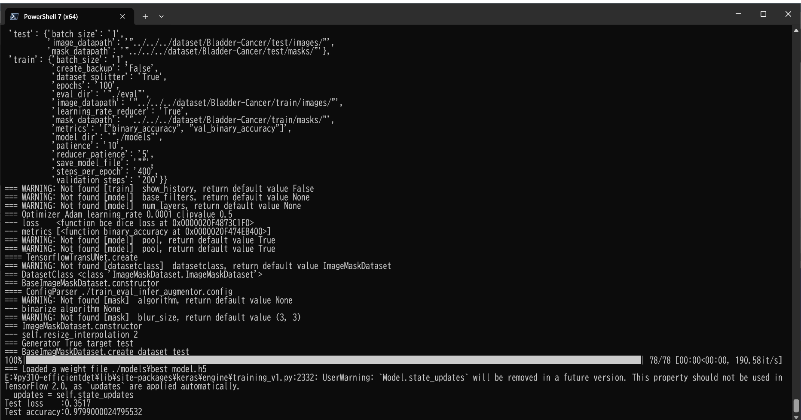

<h2>TensorflowTransUNet-Image-Segmentation-Augmented-Bladder-Cancer (2024/03/15)</h2>

This is an experimental Image Segmentation project for Bladder-Cancer based on
the <a href="https://github.com/sarah-antillia/Tensorflow-Image-Segmentation-API">Tensorflow-Image-Segmentation-API</a>, and
<a href="https://drive.google.com/file/d/176ewCOeQA1_lhqjGpykJFhaLdvTRYCn5/view?usp=sharing">
Bladder-Cancer-ImageMask-Dataset_V2.zip</a> (2024/03/15)
 

 
 
Segmentation samples 

 
 

In order to improve segmentation accuracy, we will use an online dataset augmentation strategy based on Python script <a href="./src/ImageMaskAugmentor.py">
ImageMaskAugmentor.py</a> to train a Bladder-Cancer Segmentation Model. 
 
As a first trial, we use the Transormer UNet Model 
<a href="./src/TensorflowUNet.py">TensorflowTransUNet</a> for this Bladder-Cancer Segmentation. 
As shown in <a href="https://github.com/sarah-antillia/Tensorflow-Image-Segmentation-API">Tensorflow-Image-Segmentation-API</a>.
you may try other Tensorflow UNet Models: 

<li><a href="./src/TensorflowMultiResUNet.py">TensorflowMultiResUNet.py</a></li>
<li><a href="./src/TensorflowAttentionUNet.py">TensorflowAttentionUNet.py</a></li>
<li><a href="./src/TensorflowEfficientUNet.py">TensorflowEfficientUNet.py</a></li>
<li><a href="./src/TensorflowUNet3Plus.py">TensorflowUNet3Plus.py</a></li>
 

<h3>1. Dataset Citation</h3>
The image dataset used here has been taken from the following github site. 
<a href="https://github.com/17764592882/bladder_cancer_dataset">bladder_cancer_dataset</a>

<b>About Dataset</b>
<pre>
The source of dataset is the Humble Cup in 2018. There are 768 images of Cancer.
</pre>
<pre>
Thanks to the organizing committee of China College Students Computer Design Competition.Among them, 
there are 768 pictures of lesions, as shown in the folder tumour_label.
The pixel value of 255 represents the lesion spots, the gray area represents the bladder wall, and 
the black area represents the background.The images display in the folder tumour_image are the 
magnetic resonance image.
</pre>

 

<h3>
<a id="2">
2 Bladder-Cancer ImageMask Dataset
</a>
</h3>
 If you would like to train this Bladder-Cancer Segmentation model by yourself,
 please download the latest normalized dataset from the google drive 
<a href="https://drive.google.com/file/d/176ewCOeQA1_lhqjGpykJFhaLdvTRYCn5/view?usp=sharing">
Bladder-Cancer-ImageMask-Dataset_V2.zip</a> (2024/03/15)
 

 
Please expand the downloaded ImageMaskDataset and place them under <b>./dataset</b> folder to be

<pre>
./dataset
└─Bladder-Cancer
    ├─test
    │  ├─images
    │  └─masks
    ├─train
    │  ├─images
    │  └─masks
    └─valid
        ├─images
        └─masks
</pre>
 
 
<b>Bladder-Cancer Dataset Statistics</b> 
 

As shown above, the number of images of train and valid dataset is not necessarily large. Therefore the online dataset augmentation strategy may 
be effective to improve segmentation accuracy.

 

<h3>
<a id="3">
3 TensorflowTransUNet
</a>
</h3>
This <a href="./src/TensorflowTransUNet.py">TensorflowTransUNet</a> model is slightly flexibly customizable by a configuration file. 
For example, <b>TensorflowTransUNet/Bladder-Cancer</b> model can be customizable
by using <a href="./projects/TensorflowTransUNet/Bladder-Cancer/train_eval_infer_augmentor.config">train_eval_infer_augmentor.config</a>
<pre>
; train_eval_infer_augmentor.config
; 2024/03/15 (C) antillia.com
; Modified to use loss and metric
;
[model]
model          = "TensorflowTransUNet"
generator      = True
image_width    = 512
image_height   = 512

;activation     = "mish"
optimizer      = "Adam"

image_channels = 3
num_classes    = 1
;num_layers     = 6

filter_num     =  [16, 32, 64, 128]

stack_num_down = 2
stack_num_up   = 2
embed_dim      = 512

num_mlp        = 512

num_heads      = 4
num_transformer= 4

activation     = 'ReLU'
mlp_activation = 'GELU'
batch_norm     = False
backbone       = None
weights        = 'imagenet'
freeze_backbone= True
freeze_batch_norm=True

dropout_rate    = 0.04
learning_rate  = 0.0001
clipvalue      = 0.5
loss           = "bce_dice_loss"
metrics        = ["binary_accuracy"]
show_summary   = False

[dataset]
datasetclass  = "ImageMaskDataset"
resize_interpolation = "cv2.INTER_CUBIC"

[train]
save_model_file = ""
dataset_splitter = True
learning_rate_reducer = True
reducer_patience      = 5
steps_per_epoch       = 400
validation_steps      = 200
epochs        = 100
batch_size    = 1
patience      = 10
metrics       = ["binary_accuracy", "val_binary_accuracy"]
model_dir     = "./models"
eval_dir      = "./eval"
image_datapath = "../../../dataset/Bladder-Cancer/train/images/"
mask_datapath  = "../../../dataset/Bladder-Cancer/train/masks/"
create_backup  = False

[eval]
image_datapath = "../../../dataset/Bladder-Cancer/valid/images/"
mask_datapath  = "../../../dataset/Bladder-Cancer/valid/masks/"
batch_size    = 1

[test]
image_datapath = "../../../dataset/Bladder-Cancer/test/images/"
mask_datapath  = "../../../dataset/Bladder-Cancer/test/masks/"
batch_size    = 1

[infer] 
images_dir    = "../../../dataset/Bladder-Cancer/test/images/" 
output_dir    = "./test_output"
merged_dir    = "./test_output_merged"

[mask]
blur        = False
binarize    = True
threshold   = 128

[generator]
debug        = True
augmentation = True

[augmentor]
vflip    = True
hflip    = True
rotation = True
angles   = [5, 10, 15 ]
shrinks  = [0.8]
shears   = [0.2]
transformer = True
alpah       = 1300
sigmoid     = 8
</pre>

Please note that the online augementor 
<a href="./src/ImageMaskAugmentor.py">
ImageMaskAugmentor.py</a> reads the parameters in [generator] and [augmentor] sections, and yields some images and mask depending on the batch_size,
 which are used for each epoch of the training and evaluation process of this UNet Model. 
<pre>
[augmentor]
vflip    = True
hflip    = True
rotation = True
angles   = [5, 10, 15 ]
shrinks  = [0.8]
shears   = [0.2]
transformer = True
alpah       = 1300
sigmoid     = 8
</pre>
Depending on these parameters in [augmentor] section, it will generate vflipped, hflipped, rotated, shrinked,
sheared, elastic-transformed images and masks
from the original images and masks in the folders specified by image_datapath and mask_datapath in 
[train] and [eval] sections. 
<pre>
[train]
image_datapath = "../../../dataset/Bladder-Cancer/train/images/"
mask_datapath  = "../../../dataset/Bladder-Cancer/train/masks/"
[eval]
image_datapath = "../../../dataset/Bladder-Cancer/valid/images/"
mask_datapath  = "../../../dataset/Bladder-Cancer/valid/masks/"
</pre>

For more detail on ImageMaskAugmentor.py, please refer to
<a href="https://github.com/sarah-antillia/Image-Segmentation-ImageMaskDataGenerator">
Image-Segmentation-ImageMaskDataGenerator.</a>.
    
 

<h3>
3.1 Training
</h3>
Please move to a <b>./projects/TensorflowTransUNet/Bladder-Cancer</b> folder, 
and run the following bat file to train TensorflowUNet model for Bladder-Cancer. 
<pre>
./1.train_generator.bat
</pre>
, which simply runs <a href="./src/TensorflowUNetGeneratorTrainer.py">TensorflowUNetGeneratorTrainer.py </a>
in the following way.

<pre>
python ../../../src/TensorflowUNetGeneratorTrainer.py ./train_eval_infer_augmentor.config
</pre>
Train console output: 
 
Train metrics: 
 
Train losses: 
 
 

The following debug setting is helpful whether your parameters in [augmentor] section are good or not good.
<pre>
[generator]
debug     = True
</pre>
You can check the yielded images and mask files used in the actual train-eval process in the following folders under
<b>./projects/TensorflowTransUNet/Bladder-Cancer/</b>.  
<pre>
generated_images_dir
generated_masks_dir
</pre>

Sample images in generated_images_dir 
 
Sample masks in generated_masks_dir 
 

<h3>
3.2 Evaluation
</h3>
Please move to a <b>./projects/TensorflowTransUNet/Bladder-Cancer</b> folder, 
and run the following bat file to evaluate TensorflowUNet model for Bladder-Cancer. 
<pre>
./2.evaluate.bat
</pre>
<pre>
python ../../../src/TensorflowUNetEvaluator.py ./train_eval_infer_augmentor.config
</pre>
Evaluation console output: 

<pre>

</pre>

<h2>
3.3 Inference
</h2>
Please move to a <b>./projects/TensorflowTransUNet/Bladder-Cancer</b> folder 
,and run the following bat file to infer segmentation regions for images by the Trained-TensorflowUNet model for Bladder-Cancer. 
<pre>
./3.infer.bat
</pre>
<pre>
python ../../../src/TensorflowUNetInferencer.py ./train_eval_infer_augmentor.config
</pre>
Sample test images 
 
Sample test mask (ground_truth) 
 

 
Inferred test masks 
 
 
Merged test images and inferred masks  
  

Enlarged samples 
<table>
<tr>
<td>
test/images/19.jpg 

</td>
<td>
Inferred merged/19.jpg 

</td> 
</tr>

<tr>
<td>
test/images/126.jpg 

</td>
<td>
Inferred merged/126.jpg 

</td> 
</tr>

<tr>
<td>
test/images/174.jpg 

</td>
<td>
Inferred merged/174.jpg 

</td> 
</tr>

<tr>
<td>
test/images/349.jpg 

</td>
<td>
Inferred merged/349.jpg 

</td> 
</tr>

<!-- 5-->
<tr>
<td>
test/images/353.jpg 

</td>
<td>
Inferred merged/353.jpg 

</td> 
</tr>

</table>

<h3>
References
</h3>
<b>1. Bladder Cancer Segmentation in CT for Treatment Response Assessment: Application of Deep-Learning Convolution Neural Network—A Pilot Study</b> 
Kenny H. Cha, Lubomir M. Hadjiiski, Ravi K. Samala, Heang-Ping Chan, Richard H. Cohan, 
Elaine M. Caoili, Chintana Paramagul, Ajjai Alva, and Alon Z. Weizer 
Tomography. 2016 Dec; 2(4): 421–429. 
doi: 10.18383/j.tom.2016.00184 
<pre>
https://www.ncbi.nlm.nih.gov/pmc/articles/PMC5241049/
</pre>

<b>2. Bladder segmentation based on deep learning approaches:current limitations and lessons</b> 
Mark G. Bandyk, Dheeraj R Gopireddy, Chandana Lall, K.C. Balaji, Jose Dolz 
<pre>
https://arxiv.org/pdf/2101.06498.pdf
</pre>

<b>3. Fully automated bladder tumor segmentation from T2 MRI images using 3D U-Net algorithm</b> 
Diana Mihaela Coroam, Laura Dio, Teodora Telecan, Iulia Andras, Nicolae Crișan, 
Paul Medan, Anca Andreica, Cosmin Caraiani, Andrei Lebovici,Bianca Boca, Zoltán Bálint 
Front. Oncol., 09 March 2023 
Sec. Genitourinary Oncology 
Volume 13 - 2023 | https://doi.org/10.3389/fonc.2023.1096136 
<pre>
https://www.frontiersin.org/journals/oncology/articles/10.3389/fonc.2023.1096136/full
</pre>

<b>4. Tensorflow-Image-Segmentation-Augmented-Bladder-Cancer</b> 
Toshiyuki Arai @antillia.com 
<pre>
https://github.com/sarah-antillia/Tensorflow-Image-Segmentation-Augmented-Bladder-Cancer
</pre>

<b>5. ImageMask-Dataset-Bladder-Cancer</b> 
Toshiyuki Arai @antillia.com 
<pre>
https://github.com/sarah-antillia/ImageMask-Dataset-Bladder-Cancer
</pre>